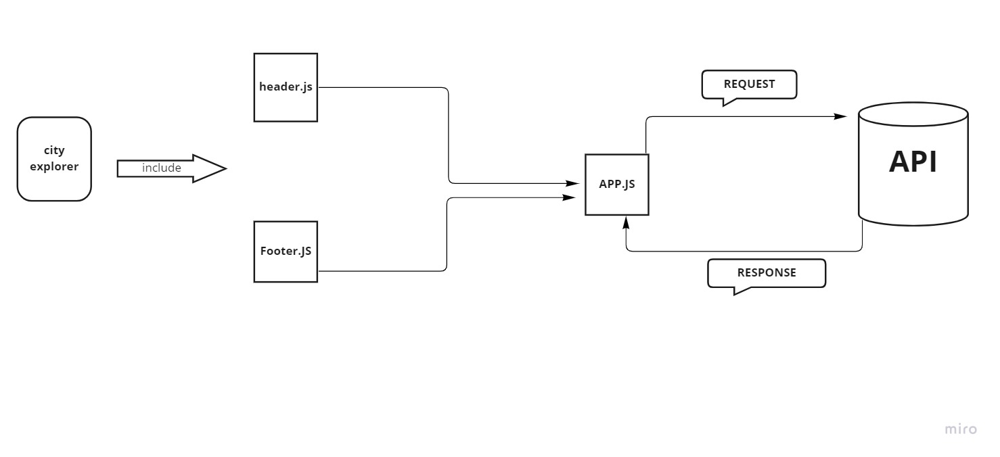

# City Explore

Deployed Site : [City Explore](https://keen-sundae-d78ea0.netlify.app/)

**Author :** Razan Alowedat
**Version :** 1.0.0

## Overview

city explorer website help you to find where you are gives you small map dispaly to you the places around you.

## Getting Started

To build such web app follow the following steps:

1. Create a new React App.
2. Install the libraries.
3. Make a LocationIQ account to get access to the API.
4. Structure your components.
5. Fetch the data from the form and pass it to the API.
6. Get back the data from the API.
7. Render it in your code .
8. Style your web application.

## Architecture

this website was made using React ,Bootstarp ,Axios and LocationIQ.

## Methodology and Working Flow

## Credit and Collaborations

[Noor Al-khateeb ](https://github.com/noor-alkhateeb) 

## Time Estimates

**Name of feature :** Input form, GET request

**Estimate of time needed to complete :** 5 hours

**Start time :** 28-8-2022 2:00pm

**Finish time :** 29-8-2022 6:00pm

**Actual time needed to complete :** 10 hours